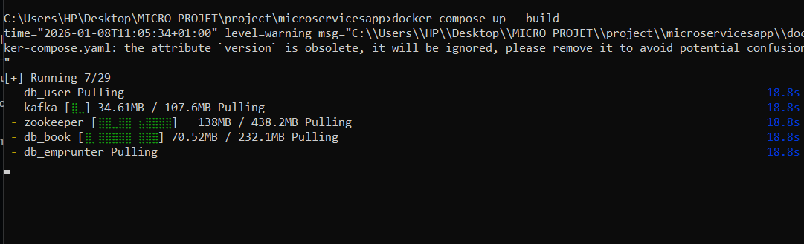
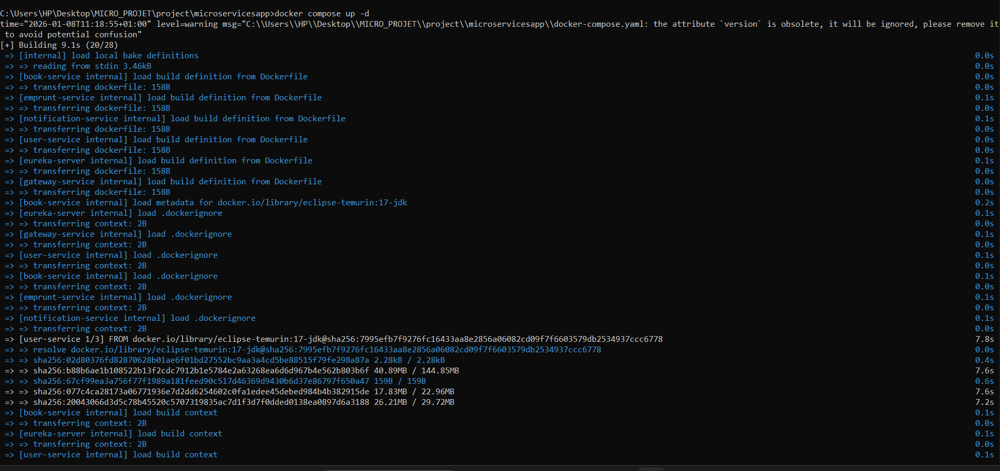
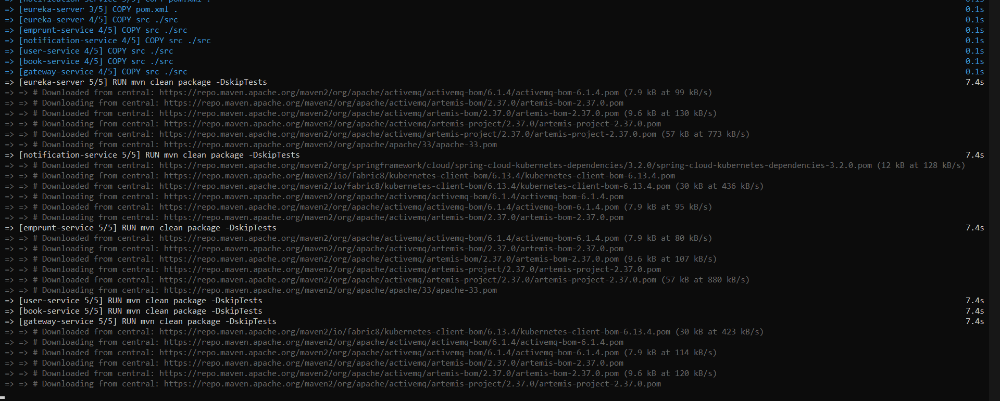
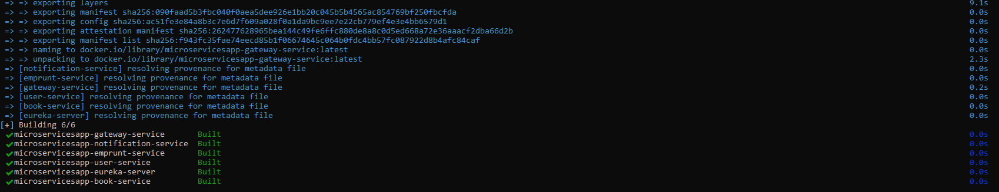
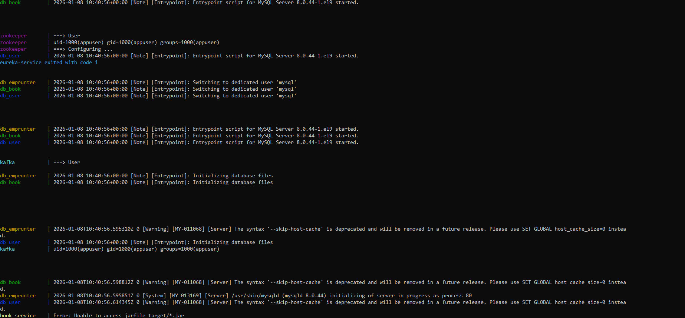
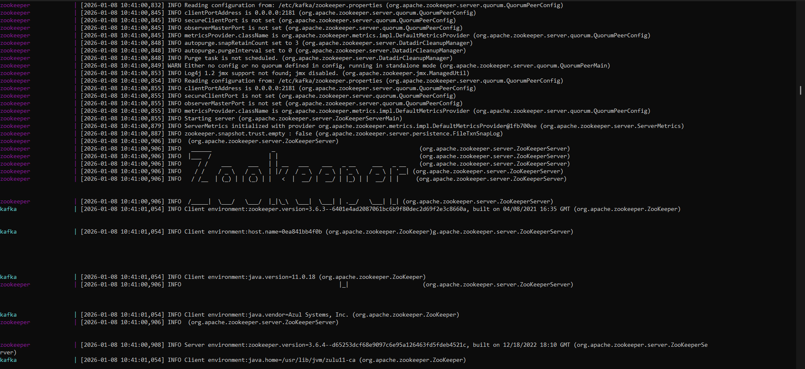
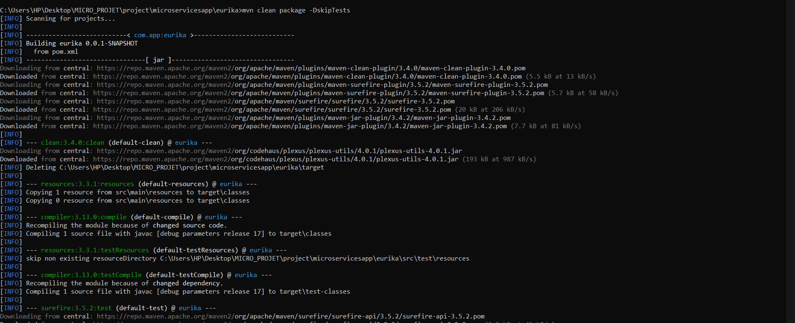
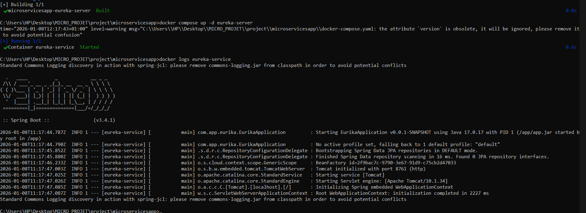
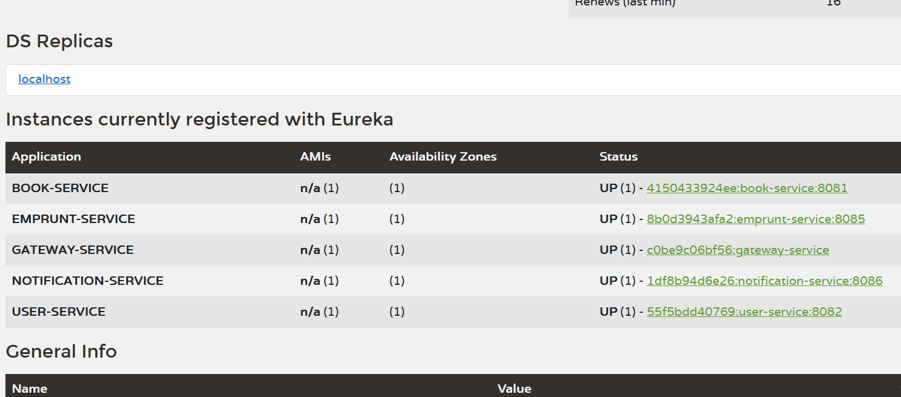
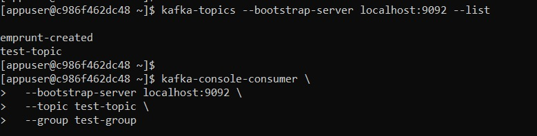

# Analyse des images du projet microservices

Les images montrent le déploiement et l'exécution d'une application microservices. Voici une explication détaillée :

## **Image 1 & 9** - Docker Compose Up (État global)



Lancement de tous les conteneurs avec `docker compose up -d` :

**Conteneurs en cours d'exécution :**
- ✅ `db_book`, `db_emprunter`, `db_user` - Bases de données MySQL (Running)
- ✅ `zookeeper` - Coordinateur pour Kafka (Running)
- ✅ `kafka` - Message broker (Running)
- 🔄 `eureka-service` - Service de découverte (Recreated - redémarrage)
- 🔄 `book-service`, `notification-service`, `user-service`, `gateway-service`, `emprunter-service` - Microservices (Recreated)

**Erreurs critiques** :
- ❌ **"Unable to access jarfile target/*.jar"** - Les fichiers JAR n'existent pas dans les conteneurs
- ❌ Services métier sortent avec **code 1** (échec)
- ⚠️ **commons-logging.jar conflict** - Problème de dépendance

---

## **Image 2, 3, 4** - Docker Compose Build




Construction des images Docker :

**Étape 1** - Chargement des contextes :
```
[book-service internal] load build definition from Dockerfile
[eureka-server internal] load build definition from Dockerfile
...
```

**Étape 2** - Téléchargement des dépendances Maven :
- Téléchargement des plugins Maven (clean, compiler, surefire)
- Récupération des dépendances Spring Boot, ActiveMQ, Artemis
- Images base Java/JDK

**Étape 3** - Export et build :
```
[+] Building 6/6
✔ microservicesapp-gateway-service     Built
✔ microservicesapp-notification-service Built
✔ microservicesapp-emprunter-service   Built
✔ microservicesapp-user-service        Built
✔ microservicesapp-eureka-server       Built
✔ microservicesapp-book-service        Built
```

---

## **Image 5** - Logs des bases de données


Démarrage des conteneurs MySQL :

**db_book** :
```
Entrypoint script for MySQL Server 8.0.44-1.el9 started
Switching to dedicated user 'mysql'
Initializing database files
```

**db_emprunter, db_user** :
- Même processus d'initialisation
- Création des utilisateurs et bases de données

✅ **Toutes les bases MySQL sont opérationnelles**

---

## **Image 6** - Logs de Zookeeper et Kafka


**Zookeeper** :
```
INFO Reading configuration from: /etc/kafka/zookeeper.properties
INFO clientPortAddress is 0.0.0.0:2181
INFO Starting server
INFO minSessionTimeout set to 6000
```
Avec ASCII art montrant le démarrage :
```
  ____                  _                                      
 |_  /___   ___  _ __  | | __ ___  ___ _ __   ___ _ __
  / // _ \ / _ \| |_ \ | |/ // _ \/ _ \ '_ \ / _ \ '__|
 /___\___/\___/|_.__/ |___/\___/\___/ .__/\___|_|
```

**Kafka** :
```
INFO Client environment:java.version=11.0.18
INFO Client environment:java.vendor=Azul Systems, Inc.
```

✅ **Infrastructure Kafka fonctionnelle**

---

## **Image 7** - Maven Build local (Eureka)


Compilation du projet eureka en local :

```
mvn clean package -DskipTests
[INFO] Building eureka 0.0.1-SNAPSHOT
[INFO] --- maven-clean-plugin:3.4.0:clean
[INFO] --- maven-jar-plugin:3.4.2:jar
[INFO] --- resources:3.3.1:resources
[INFO] Copying 1 resource to target\classes
[INFO] --- compiler:3.13.0:compile
Compiling 1 source file with javac [release 17]
[INFO] --- surefire:3.5.2:test (skipped)
```

✅ **Build réussi localement**

---

## **Image 8** - Lancement Eureka seul + Logs


Tentative de démarrage uniquement d'Eureka :

```
docker compose up -d eureka-server
✔ Container eureka-service Started

docker logs eureka-service
```

**Sortie** :
```
  .   ____          _            __ _ _
 /\\ / ___'_ __ _ _(_)_ __  __ _ \ \ \ \
( ( )\___ | '_ | '_| | '_ \/ _` | \ \ \ \
 \\/  ___)| |_)| | | | | || (_| |  ) ) ) )
  '  |____| .__|_| |_|_| |_\__, | / / / /
 =========|_|==============|___/=/_/_/_/
 :: Spring Boot ::       (v3.4.1)

Starting EurikaApplication v0.0.1-SNAPSHOT using Java 17.0.17
Tomcat initialized with port 8761 (http)
Starting Servlet engine: [Apache Tomcat/10.1.34]
Initializing Spring embedded WebApplicationContext
Root WebApplicationContext: initialization completed in 2227 ms
```

⚠️ **Avertissement commons-logging** mais Eureka démarre correctement

---

## **Image 10** - Eureka Dashboard - Registered Instances


Instances currently registered with Eureka

| Application | AMIs | Availability Zones | Status |
|-------------|------|---------------------|--------|
| BOOK-SERVICE | n/a (1) | (1) | UP (1) - 4150433924ee:book-service:8081 |
| EMPRUNT-SERVICE | n/a (1) | (1) | UP (1) - 8b0d3943afa2:emprunt-service:8085 |
| GATEWAY-SERVICE | n/a (1) | (1) | UP (1) - c0be9c06bf56:gateway-service |
| NOTIFICATION-SERVICE | n/a (1) | (1) | UP (1) - 1df8b94d6e26:notification-service:8086 |
| USER-SERVICE | n/a (1) | (1) | UP (1) - 55f5bdd40769:user-service:8082 |

---

## **Image 11** - Configuration Kafka et Connexion



Cette image montre la configuration de Kafka dans un conteneur Docker et les commandes pour interagir avec les topics.

**Commandes exécutées dans le conteneur Kafka :**

- Lister les topics :
  ```
  kafka-topics --bootstrap-server localhost:9092 --list
  emprunt-created
  test-topic
  ```

- Tenter de consommer des messages :
  ```
  kafka-console-consumer --bootstrap-server localhost:9092 --topic test-topic --group test-group
  ```

**Problème identifié :**

Le service notification ne pouvait pas se connecter à Kafka en raison d'une configuration manquante des listeners dans docker-compose.yaml. Le broker n'écoutait que sur le port 9092, mais les services internes tentaient de se connecter sur le port 29092.

**Solution appliquée :**

Ajout de la variable d'environnement `KAFKA_LISTENERS` pour permettre à Kafka d'écouter sur les ports externes (9092) et internes (29092) :

```yaml
environment:
  KAFKA_LISTENERS: PLAINTEXT://0.0.0.0:9092,PLAINTEXT_INTERNAL://0.0.0.0:29092
  KAFKA_LISTENER_SECURITY_PROTOCOL_MAP: PLAINTEXT:PLAINTEXT,PLAINTEXT_INTERNAL:PLAINTEXT
  KAFKA_ADVERTISED_LISTENERS: PLAINTEXT://localhost:9092,PLAINTEXT_INTERNAL://kafka:29092
```

Cela permet aux services internes de se connecter via `kafka:29092` tout en gardant l'accès externe via `localhost:9092`.

---

# 🔴 Problème principal identifié

**Les fichiers JAR ne sont pas créés dans les conteneurs Docker** :
```
Error: Unable to access jarfile target/*.jar
```

## Causes probables :
1. **Dockerfile manquant l'étape de build Maven**
2. **Les .jar ne sont pas copiés dans l'image finale**
3. **Multi-stage build mal configuré**

## Solution suggérée :
Vérifier que chaque Dockerfile contient :
```dockerfile
FROM maven:3.8-openjdk-17 AS build
COPY pom.xml .
COPY src ./src
RUN mvn clean package -DskipTests

FROM openjdk:17-jdk-slim
COPY --from=build /target/*.jar app.jar
ENTRYPOINT ["java", "-jar", "/app.jar"]